# Проектная работа
Тема: «Интеграция dbt с Greenplum: инкрементальный ETL от PostgreSQL до ClickHouse»

MPV: 
1. Развернута инфраструктура в `Docker`: 
- `PostgreSQL` — источник данных.
- `Greenplum` — основное хранилище DWH.
- `ClickHouse` — система для работа с конечными витринами для отчётности.
- `Airflow` — орекстратор процессов.
2. В `PostgreSQL` предзагружены данные, которые будут использовать для дальнейшей работы.
3. Подключен `DBT`, который будет обращаться через внешние таблицы к `PostgreSQL` и загружать их в `Greenplum` в слой сырых данных. Заложена логика на инкрементальную загрузку.
4. Прописана трансформация данных через `DBT` внутри `Greenplum`. Построение финальных витрин, которые в дальнейшем попадут в `ClickHouse`. 
5. Реализована интеграция `Greenplum` и `ClickHouse`.
6. Все процессы должны осуществляться автоматически с помощью `Airflow`.

## Шаги реализации
### 1. Развертывание инфраструктуры
#### `Greenplum`
Первым шагом я решил развернуть `Greenplum`. Не стал брать образ с курса, решил посмотреть те, что используются сейчас.
Был выбран следующий образ, т.к есть `PXF` из коробки:
https://github.com/pro100filipp/greenplum-pxf-docker
```bash
docker run --name gpdb -p 5432:5432 -d pro100filipp/greenplum-with-pxf
```
Проверил подключение, что все нормально работает:
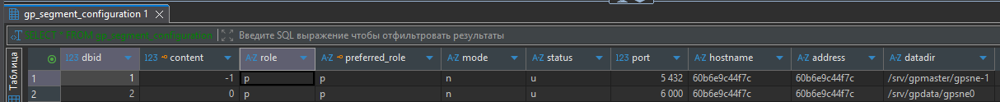
#### `PosgreSQL`
Для развертывания `PostgreSQL` использовал официальный образ:
https://hub.docker.com/_/postgres
```bash
docker pull postgres:16-alpine
docker run --name postgres-source -e POSTGRES_USER=source_user -e POSTGRES_PASSWORD=source_pass -e POSTGRES_DB=source_db -p 5433:5432 -d postgres:16-alpine
```
Проверим подключение:  
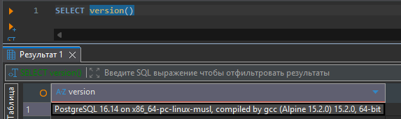
#### `ClickHouse`
На официальном сайте `ClickHouse` нашел инструкцию по развертыванию образа:
https://clickhouse.com/docs/ru/install/docker
```bash
docker pull clickhouse/clickhouse-server
docker run -d --name clickhouse -p 8123:8123 -p 9000:9000 -e CLICKHOUSE_USER=admin -e CLICKHOUSE_PASSWORD=admin --ulimit nofile=262144:262144 clickhouse/clickhouse-server
```
Также проверим соединение:  
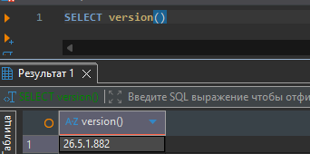
#### `Airflow`
Для подключения `Airflow` скачать образ и запустить его не достаточно, согласно инструкции
https://airflow.apache.org/docs/apache-airflow/stable/howto/docker-compose/index.html  
Выполнил следующие команды следуя по инструкции:
```bash
curl -LfO 'https://airflow.apache.org/docs/apache-airflow/3.2.2/docker-compose.yaml'
mkdir -p ./dags ./logs ./plugins ./config
echo -e "AIRFLOW_UID=$(id -u)" > .env
docker compose up airflow-init
docker compose up
```
Через некоторое время `Airflow` был успешно запущен:
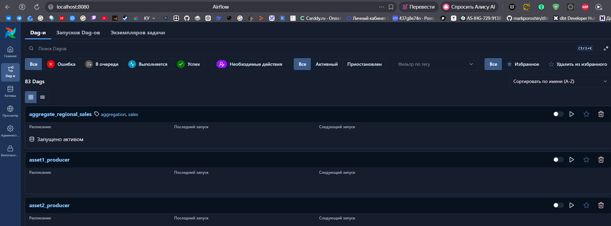
#### Результат
В результате мы имеем всю необходимую инфраструктуру для дальнейшей работы по проекту:
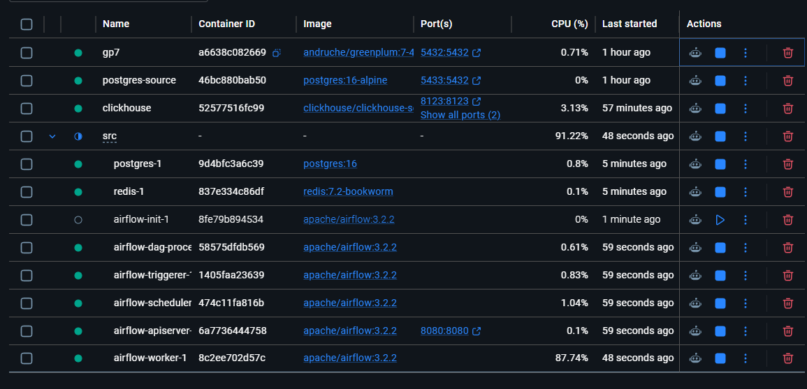

### 2. Подготовка данных в `PostgreSql`
Для проектной работы я буду использовать датасет, которые использовали в течение курса `TPC-H`.  
Следующие модели будут использованы (файл `sql/psql_models.py`):
- `customer`
- `supplier`
- `nation`
- `region`  

В моделях понадобятся некоторые изменения, например необходимо поле `updated_at` по которому будем следить за инкрементом.  
Сразу встала задача, как заполнить это поле разными значениями и загрузить их на источник.
План следующий:
1. Определяем за какой период мы вообще будем делать симуляцию. Для проекта возьму январь 2026 года. Т.е раскидаем для записей `updated_at` в течение месяца.
2. Запуск `Airflow` будем планировать, как ежедневный.  
3. Для заполнения напишем небольшой скрипт на `Python` (`scripts/fill_psql_models.py`) с использованием `Pandas` и `Psycopg2`.  
На этом этапе создаем окружение и добавляем зависимости `requirements.txt`.
#### Результат
Имеем скрипт, который создает структуру в БД, а также наполняем данными с полем `updated_at`. Например для `customer` имеем данные на каждый день в январе:  
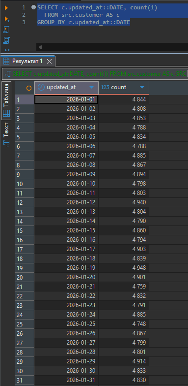
### 3. Подключаем `DBT` к проекту
#### Проверка систем
Прежде чем подключать `DBT`, убедимся, что `PXF` работает и вообще у нас можно подключаться между системами в `Docker`.  
Создадим общую сеть и подключим туда все БД:
```bash
docker network create data_platform
docker network connect data_platform gpdb
docker network connect data_platform postgres-source
docker network connect data_platform clickhouse
```
Создал внешнюю таблицу в `Greenplum`, забрала данные из `PostgreSQL`, все отлично работает:  
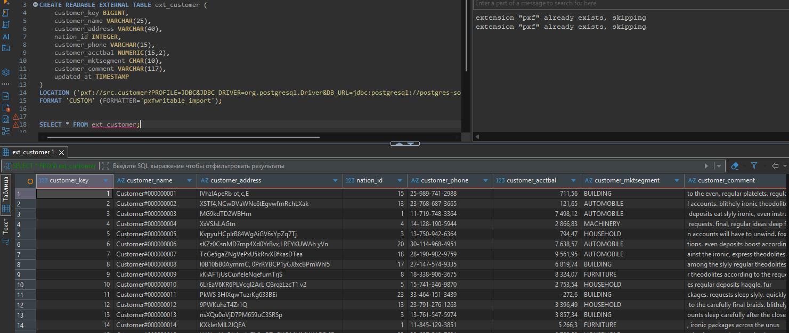
#### Подключение `DBT`
Приступив к установке `dbt-greenplum` через `pip` сразу же столкнулся с проблемой, что необходимы инструменты разработки на `C++` от `Microsoft`: 
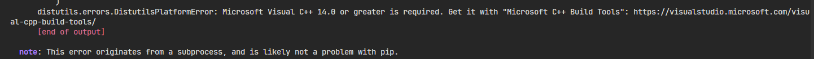
После их установки, все «успешно» установилось, но столкнулся с проблемой, что `DBT` работает на более старой версии `Python`. Пришлось установить `Python 3.10` и переустановить все зависимости, но все не зря, `DBT` установился:
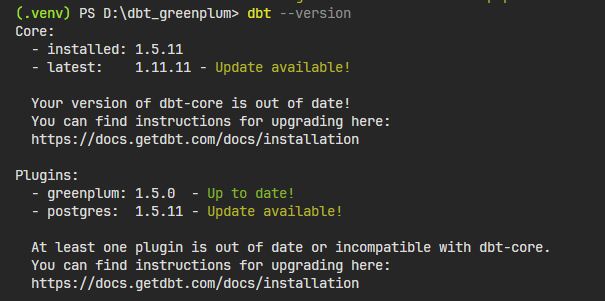  
Создаем проект:
```bash
dbt init gp_project
```
После инициализации проекта, в папке `.dbt` для пользователя был создан файл `profiles.yml`, который содержит параметры для подключения к `Greenplum`. Заполнил его, после чего проверил, что все отлично подключается:
```bash
dbt debug
```
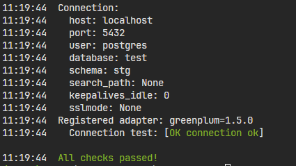
#### Создание внешних таблиц в `Greenplum`
Ранее я проверил, что `PXF` работает, теперь надо создать внешние таблицы в `Greenplum`, но использовать в чистом виде логин и пароль мы не можем, пришлось настроить это отдельно.  
Для этого я создал отдельный сервер `pg_source` и заполнил `jdbc-site.xml` для подключения к нашей `PostgreSQL` с последющей синхронизацией через:
```bash
pxf cluster sync
pxf cluster restart
```
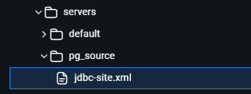  
Далее прогоним модели (файл `gp_ext_models.sql`) и убедимся, что все корректно работает:  
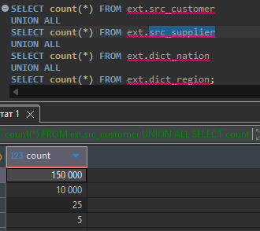
### 4. Проработка моделей с помощью `DBT`
После изучения документации, сделал небольшой тест `DBT`, создал `schema.yml` для системы источника и модель для `customer` для слоя `staging`. Пока что без какой-либо сложной логики, просто отобрал все записи. По итогу все отработало, как ожидалось, в `stg.customer` оказались все данные из `ext.src_customer`
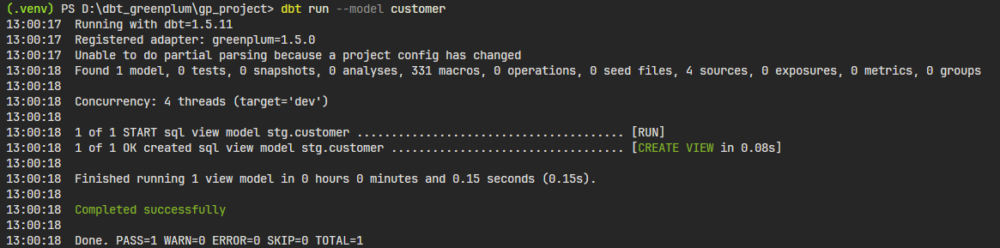
Далее начал изучать вопрос, как можно динамически грузить данные. Для этого надо использовать `materialized='incremental'`.  
Также понадобился макрос, который будет в зависимости от того, передана дата или нет, формировать дату, которую мы должны анализировать (`macros/get_load_data.sql`). Если даты нет, будем анализировать дату запуска - 1 день, иначе переданную дату.  
Далее после внесенных изменений произвел запуск:
```bash
dbt run --model customer --vars '{"load_date": "2026-01-01"}'
```
Отлично, судя по количеству записей все работает как надо:  
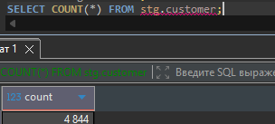  
Также потом произвел запуск без входной даты, как и ожидалось, количество записей не изменилось, т.к за дату нет данных:
```bash
dbt run --model customer
```
Я решил разместить справочники в отдельной схеме, они будут перезагружаться всегда полностью и с распределением `REPLICATED`. Получилась следующая структура:
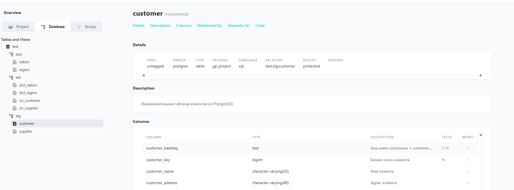
Также, чтобы убедиться в корректности работы, прогнал все модели:
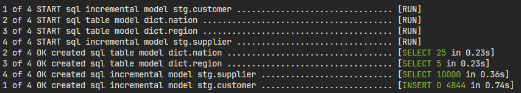  
Следующим шагом станет создание `mart` слоя, который будем источником для `ClickHouse`. Добавил пару не сложных аналитических запросов, будем определять количество поставщиков и клиентов в разрезе их региона:
- `mart.customers_by_region`
- `mart.suppliers_by_region`

Также проверил, что все работает и данные получаем:
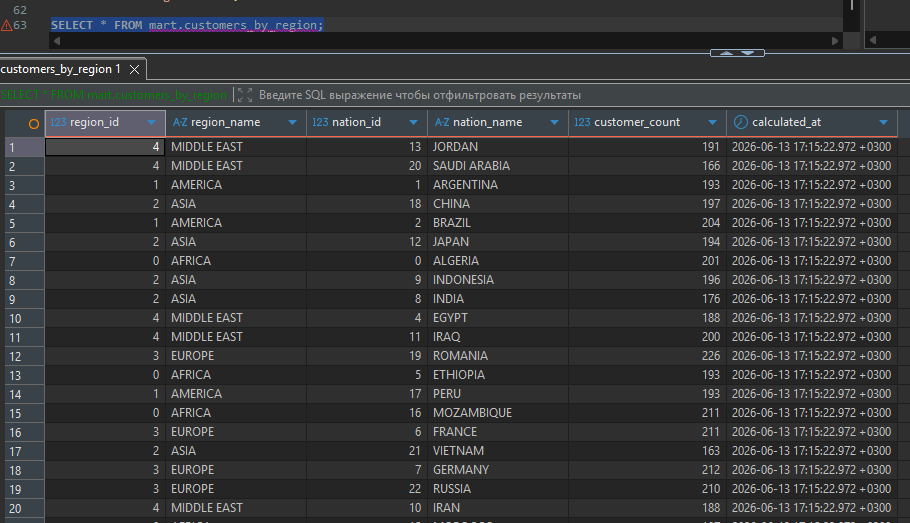

### 5. Интеграция `Greenplum` и `ClickHouse`
Взаимодействовать будет за счёт внешних таблиц в `Clickhouse`, который будут смотреть на `Greenplum` (файл `ch_ext_models.sql`).
Шагом ранее я добавлял в общую сеть `ClickHouse`, но почему-то связь сломалось, добавил еще раз `ClickHouse`:
```bash
docker network connect data_platform clickhouse
```
Проверил, что все корректно работает:  
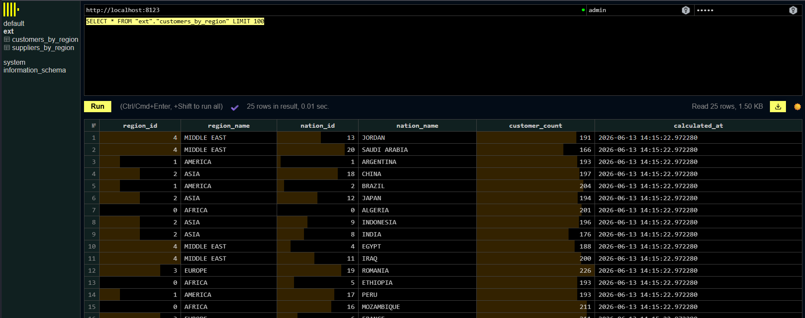
Таким образом, мы проложили пусть от `PostgreSQL` до `ClickHouse`.  
Т.к `ClickHouse` не является основной темой проекта, скрывать пароли не стал при создание `ENGINE`, также внешние таблицы лучше бы также записать в отдельные таблицы, т.к каждый раз обращение к `Greenplum` напрямую будет нагружать систему.   
Также прямое подключение через внешние таблицы поможет нам сразу видеть изменения в `Greenplum` через `ClickHouse`.
### 6. Настройка потока через `Airflow`
Финальный этап, наладить поток. Т.к на данный момент `DBT` развернут локально, а `Airflow` в `Docker`, то их надо соединить.
1. Добавил в `src/docker-compose.yaml` еще одно значение для `volume`: `- ../gp_project:/opt/airflow/gp_project`
2. Сформировал DAG `greenplum_etl.py`, который через `bash` запускает `DBT`
3. Столкнулся с проблемой, что внутри `Airflow` отсутствует `DBT`, установил на воркере `DBT`:
```bash
pip install dbt-greenplum==1.5.0
``` 
4. Следующей ошибкой было, что у нас нет файла `profiles.yml`, где должно быть описано подключение к `Greenplum`. Закинул его по пути `home/airflow/.dbt` с заменой `host` на `gbdb` вместо `localhost`. Я уже близок к решению, но.. почему-то не получается подключиться к `Greenplum`:
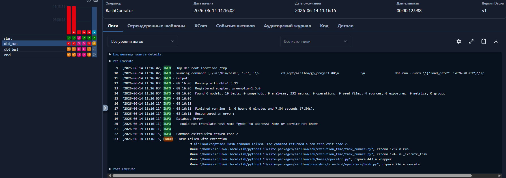
Мы не добавляли еще общую сеть, поэтому добавим.
```bash
docker network connect data_platform src-airflow-apiserver-1
docker network connect data_platform src-airflow-scheduler-1
docker network connect data_platform src-airflow-worker-1
```
Ура, все отработало!
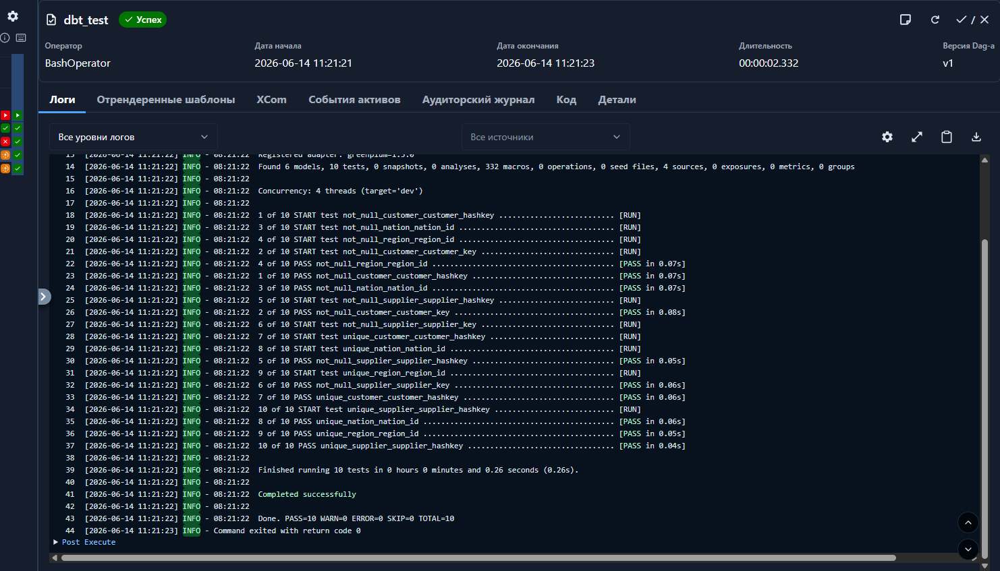
Также запустил без входной даты, все отработало корректно, `DBT` запустился без `--vars`
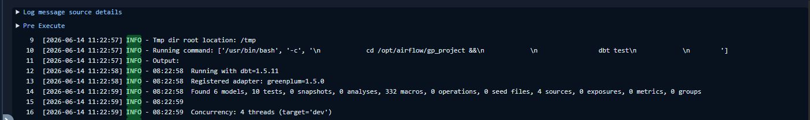
#### Финальная проверка
1. Имеем следующие данные в `ClickHouse`:
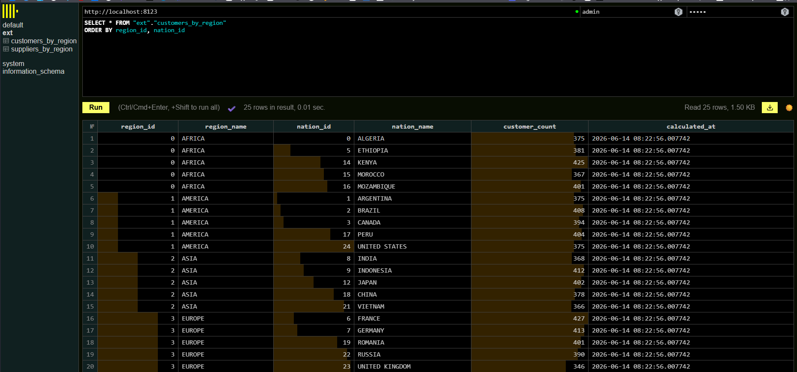
2. Произведём запуск за день, который я точно еще не запускал, например `2026-01-15`. Судя по потоку, все отработало, как мы ожидали:
- справочники перезагрузились полностью
- произошла инкрементальная загрузка клиентов и поставщиков
- пересчитались финальный витрин
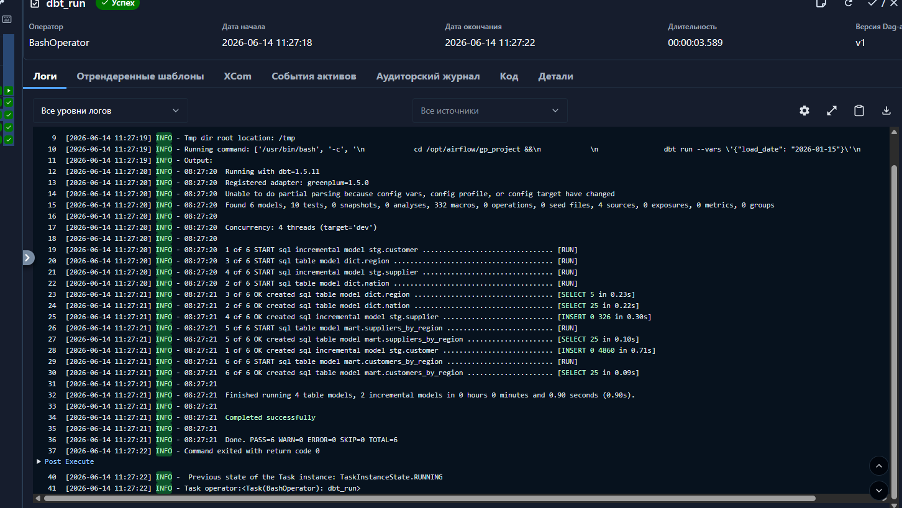
3. В `ClickHouse` увеличилось количество записей, следовательно ETL пайплайн работает корректно! 
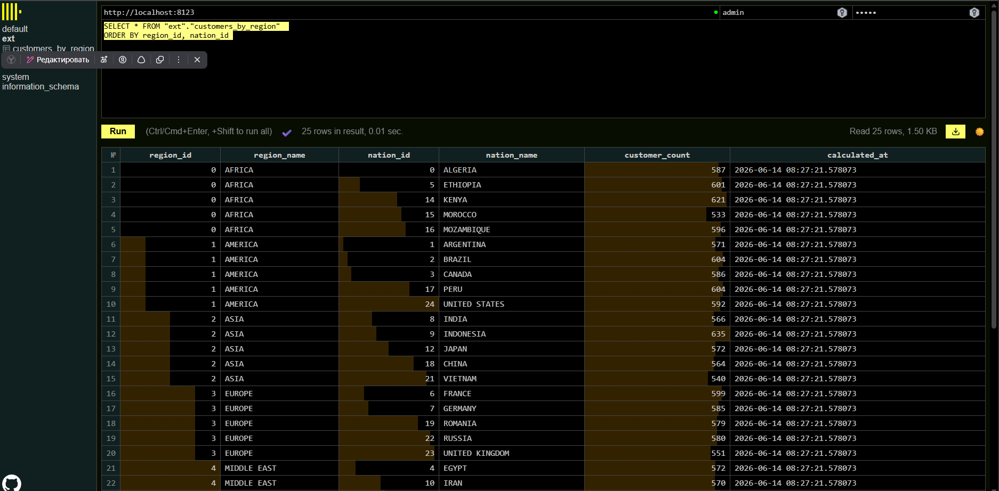 
